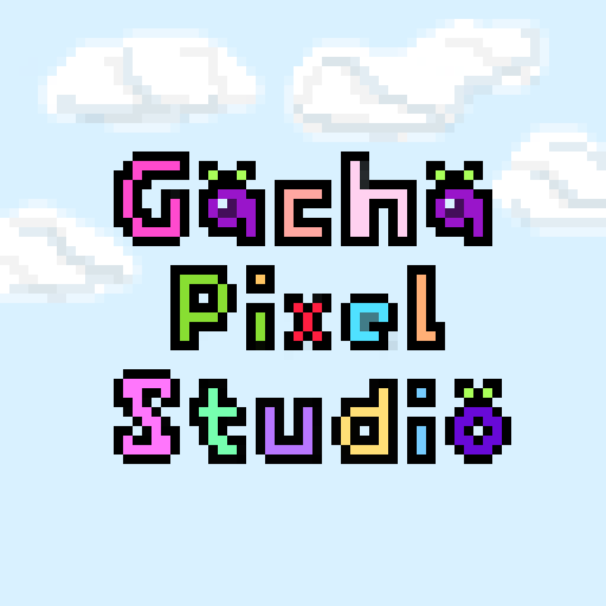

# 🎮 **Gacha Pixel Studio (GPS)** ✨
* versi 0.0.0.1_alpha

Selamat datang di **Gacha Pixel Studio** (GPS)! 🎉  
Ini adalah **game fanmade** yang menyenangkan di mana kamu bisa **mendesain karakter Gacha** dengan gaya **pixel art** yang keren! 🌟  



Gacha Pixel Studio menggunakan **HTML5** dan **CanvasJS**, jadi kamu bisa main di **browser** atau mengubahnya menjadi **APK** menggunakan Kotlin!, atau juga bisa diubah ke aplikasi windows, apple, linux!📱

---

## 🛠️ **Fitur Utama**

- **Desain Karakter Gacha** dengan cara yang **dinamis** dan **modular**! 🎨  
  Aset tubuh, wajah, pakaian, dan aksesoris semua dipisah dan bisa ditambah sesuka hati!
  **Aset karakter dibuat secara terpisah dan terkategori!**
  *Tidak ada lagi spritesheet besar yang mengikat kreativitasmu!* 😎

- **Tambahkan Aset** dengan mudah!  
  Cukup letakkan file **PNG** berisi pixel art di folder yang sesuai dan voila! 🖼️✨

- **Mini-games seru** dan **mode arcade** yang mengingatkan kita pada **Super Mario**! 🏃‍♂️💨

- **Pemain bisa menambahkan kostum dan aksesoris** baru! (Bergaya ala gacha, siapa takut?) 😁👗👒

- **Dapatkan tiket gacha** dengan bermain mini-games dan **unlock items** yang keren! 🎰

---

## ⚡ **Cara Menggunakan/Install**  

### **Main di Browser**
1. Clone repo ini atau download ZIP. 💾
2. Buka file `index.html` di browser favoritmu. 🌐
3. Download game nya di playstore dan langsung jalankan (Gacha Pixel Studio)[url]. 🎨🖌️

---

## 🏗️ **Struktur Folder**  
```
./Lunime/GPS/
/assets/              # Semua aset seperti bagian tubuh, pakaian, aksesoris.
  /kepala/            # File kepala (PNG)
    kepala0.png
    kepala1.png
  /badan/             # File badan (PNG)
    badan0.png
    badan1.png
  ...
/index.html           # Halaman utama game GPS
/script.js            # Skrip logika game utama
/style.css            # Gaya desain (CSS) game
```

---

## 📈 **Menambahkan Aset Baru**

Mudah banget! Cukup tambahkan file **PNG** yang diinginkan ke folder `/assets/`.  
- Untuk **kepala**, tambahkan file PNG ke `/assets/kepala/`.  
- Untuk **badan**, tambahkan file PNG ke `/assets/badan/`.  
Dan seterusnya! 💁‍♂️

---

## 🎮 **Mini-Games dan Arcade Mode**

Tidak hanya mendesain karakter, kamu bisa menikmati **mini-games seru** di dalam game seperti:  
- **Pixel Run** 🏃‍♀️ – Kejar skor tertinggi dengan lari tanpa henti!  
- **Berry Jumper** 🍓 – Lompat dan hindari rintangan untuk memenangkan hadiah!
- Sisa nya tambahkan...

---

## 🚀 **Pengembangan**  
Kami membuka kesempatan bagi kamu yang ingin berkontribusi! ✨  
- Bug fixes? ✅  
- Fitur baru? ✅  
- Membuat game lebih seru? ✅

Kirimkan **pull request** atau buka **issue** jika ada yang perlu diperbaiki! 💪

---

## 🧑‍🤝‍🧑 **Kontribusi**  
Jangan ragu untuk berkontribusi! Ikuti langkah-langkah berikut untuk memulai:  
1. Fork repo ini. 🍴  
2. Bekerja pada branch baru. ✨  
3. Lakukan perubahan dan kirimkan pull request. 🚀

---

## 🧡 **Terima Kasih**  
Terima kasih sudah mendukung **Gacha Pixel Studio**! 😊 Kami harap kamu menikmati game ini dan menemukan banyak kesenangan di dunia pixel art yang penuh dengan kreativitas! 🌟

Mari bermain, berkreasi, dan berbagi gaya Gacha terbaik! 🎨✨

---

## 📣 **Social Media & Community**  
Ikuti kami di [Discord](link-to-discord) untuk mendapatkan update terbaru dan berbagi kreasi!  
Jangan lupa untuk menggunakan tagar **#GachaPixelStudio** di media sosial! 💬📸

---

**Stay creative and have fun designing!** ✨🎨🖌️
